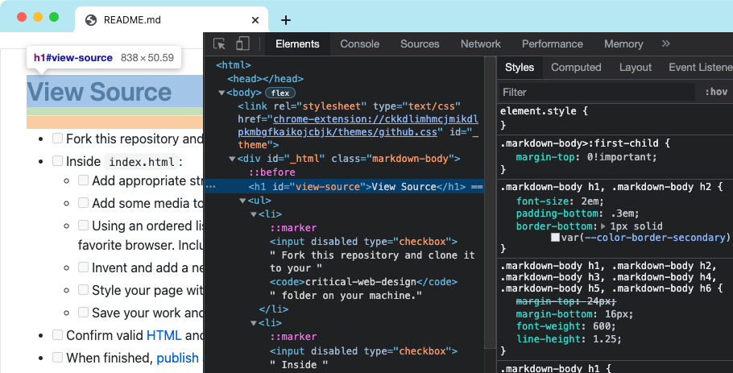

# View Source

## Instructions

Using Atom and Git

- [ ] Fork this repository and clone it to your `critical-web-design` folder on your machine.
- [ ] Inside `index.html`:
  - [ ] Add appropriate structural HTML tags (doctype, html, head, body, etc.)
  - [ ] Add some media to this page, like an image of your favorite animal.
  - [ ] Using an ordered list, write step by step instructions for viewing the HTML source of a web page in your favorite browser. Include the name of the browser.
  - [ ] Invent and add a new unique metaphor for this action (e.g. “Looking under the hood”)
  - [ ] Style your page with CSS
  - [ ] Save your work and commit and push changes regularly
- [ ] Confirm valid [HTML](https://validator.w3.org/) and [CSS](https://jigsaw.w3.org/css-validator/)
- [ ] When finished, [publish and post your project](https://docs.google.com/document/d/17U_zmzM_eML_qkG0PaOdDRcEk3YEmbiQ1TyNnbAM08k/edit#bookmark=id.8jryplv1i8a)

Grading

Points | Description
---: | ---
4 | Correct information provided
4 | Instructions followed
4 | Degree to which the metaphor was thoughtful and relevant
4 | Project is online, accessible, and linked from Moodle
4 | Valid HTML and CSS
5% | Bonus! Add a table with your weekly dream schedule (what you will do when the robots take over)
20 | Total possible

## Resources

- Course [HTML](https://github.com/omundy/dig245-critical-web-design/blob/main/reference-sheets/html.md) and [CSS](https://github.com/omundy/dig245-critical-web-design/blob/main/reference-sheets/css.md) references
