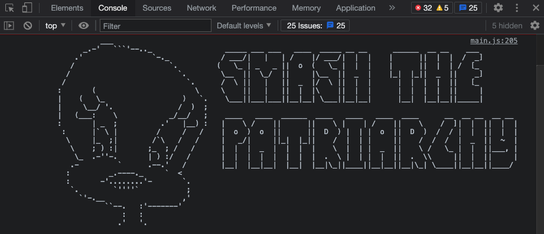
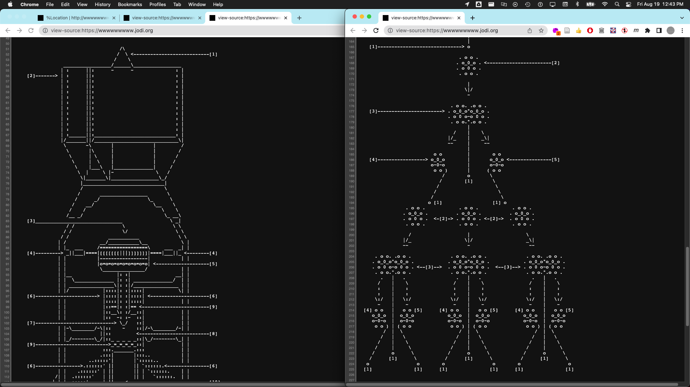

# View Source

Design & code a concrete poem with HTML/CSS

Paul Ford <a href="https://www.bloomberg.com/graphics/2015-paul-ford-what-is-code/">What is Code?</a> 2015

## Introduction

This assignment asks students to combine HTML, CSS, and JS together in a single web page while encouraging good development practices using browser dev tools.

Learning Objectives

Students who complete this assignment will be able to:

- Recall the main structural tags required for HTML documents
- Describe how to access and use Chrome Dev Tools for web development
- Compare reasons for using `<style>`, `<link>`, and `<script>` tags
- Code a web page using HTML, CSS, and Javascript

Preparation

Complete the following to prepare for this assignment: 

- Chapter 2 of Critical Web Design
- Course content listed on the schedule

Rubric

See Moodle.

## Assigment

### Setup

1. Watch this video on [Chrome Dev Tools](https://www.youtube.com/watch?v=25R1Jl5P7Mw) (11:49)
1. [Fork](https://docs.google.com/presentation/d/1vtK6LoqwF4rQQZZy-ovuEgsYUwwMRXsqDVMOjAPSBt0/edit#slide=id.gad119073e1_0_6) this repository and [clone](https://docs.google.com/presentation/d/1vtK6LoqwF4rQQZZy-ovuEgsYUwwMRXsqDVMOjAPSBt0/edit#slide=id.g9930d559e8_0_0) it to the `critical-web-design` folder on your machine.

### Design

1. Follow the prompt in Chapter 2 of CWD to create a wireframe for your concrete poem.
1. Include an image of your design in this repository.

### Code

1. Use HTML, CSS, and JS to code your design in `index.html`
1. Add appropriate structural HTML tags and attributes (`doctype`, `<html>`, `<head>`, `<body>`, etc.)
1. Style your page with CSS using `<style>` tag or an external stylesheet file. Experiment!

### Publish

1. [Save and refresh](https://github.com/omundy/learn-computing/blob/main/topics-keyboard-shortcuts.md#web-development-edit-save-refresh-loop) your work in the browser often to see your changes.
1. Commit changes regularly.
1. Confirm valid [HTML](https://validator.w3.org/) and [CSS](https://jigsaw.w3.org/css-validator/) ([?](https://github.com/omundy/dig245-critical-web-design/blob/main/topics/html-css/css.md#css-validation))
1. When finished, [push, publish, and post your project](https://docs.google.com/document/d/17U_zmzM_eML_qkG0PaOdDRcEk3YEmbiQ1TyNnbAM08k/edit#bookmark=id.8jryplv1i8a)

<!-- 
=< 2022 prompts

1. Using an ordered list, write step by step instructions for viewing the source code of a web page in your favorite browser. Include the name of the browser.
1. Using an unordered list, write three other things you can do with the Dev Tools.
1. Invent and add a new unique metaphor for this action (e.g. “Looking under the hood”).
1. Find a website with a secret message in the console or source code (see examples below). Add a screenshot and link to the page with instructions to see the mesage.
1. Using Javascript, add your own secret message for curious users to the console that somehow *reflects on the content of this assignment*. Add your code using either the `script` tag at the end of the document, or link to an external `.js` file. Experiment with different `console` [methods](https://developer.mozilla.org/en-US/docs/Web/API/console).
1. Add an image of your favorite animal somewhere on the page. -->

<!--
=< 2019 PROMPTS

Explain how your metaphor communicates the act of looking at source code
1. Does it still communicate your experience of being able to look “under the hood” after you now have learned to code?
1. Why is it important to be able to look at the source code of a web page when you are making web pages?
1. Did you look at source code to make something this semester? Write about it.
1. Why is it important to see how things you consume are constructed? What are the larger sociological arguments for transparency? Think about ingredients in the food you eat or chemicals from a factory or how laws are made for example. -->

## Resources

- Course references [HTML](https://github.com/omundy/dig245-critical-web-design/blob/main/topics/html-css/html.md), [CSS](https://github.com/omundy/dig245-critical-web-design/blob/main/topics/html-css/css.md), and [JS](https://github.com/omundy/dig245-critical-web-design/blob/main/topics/javascript/javascript.md)
- [Mozilla Developer Guides](https://developer.mozilla.org/en-US/docs/Web/Guide)

## Examples

[wwwwwwwww.jodi.org](https://wwwwwwwww.jodi.org/)

[ericwbailey.design](https://ericwbailey.design/)

[zhihu.com](https://www.zhihu.com/)

[google "text adventure"](https://www.google.com/search?q=text+adventure) [microsoft](https://microsoft.github.io/join-dev-design/)

More at [console.love](https://www.console.love/)
